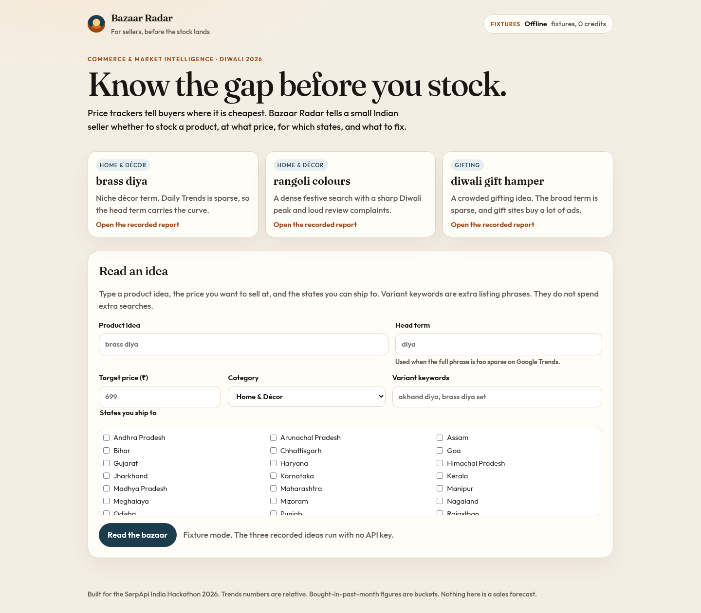
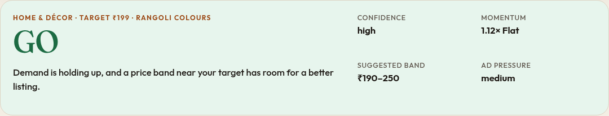
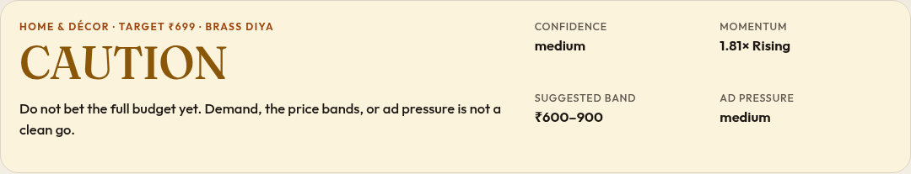

# Bazaar Radar

Bazaar Radar tells a small Indian online seller **what to stock, at what price, for which states, and what to fix** before the Diwali rush. It fuses Google Trends demand with Amazon.in and Google Shopping competition into one decision card.

Price trackers tell buyers where it is cheapest. Bazaar Radar tells sellers where the gap is.



Track: **Commerce & Market Intelligence**, SerpApi India Hackathon 2026. The demo video is recorded separately; this repo runs fully offline in fixture mode.

## Who it is for

Priya-type sellers: 1–20 SKUs (handicrafts, home décor, ethnic wear, gifting, kitchenware) listing on Amazon.in and often Meesho, Flipkart, or Instagram. Festive sales open around 8 Oct 2026. Diwali is 8 Nov 2026. They are about to commit working capital and cannot justify a US-dollar SaaS subscription. Amazon’s own tools only show Amazon.

The scale of the job:

- Amazon.in has **20 lakh+ sellers**, with 3 lakh+ new this year ([Amazon, 9 Sep 2026](https://press.aboutamazon.com/in/2026/9/amazon-indias-seller-base-grows-to-20-lakh-marking-strongest-growth-in-three-years)).
- Meesho has about 20 lakh sellers and Flipkart 14 lakh+ (Sep 2024, [PTI/Rediff](https://money.rediff.com/news/market/meesho-mega-blockbuster-sale-starts-sep-27-20-lakh-sellers/15851420240917)).
- Festive e-commerce GMV was projected at ₹1.15 lakh crore+ for 2025 ([Redseer via Business Standard](https://www.business-standard.com/industry/news/india-festive-season-ecommerce-sale-redseer-report-125082700476_1.html)).

The question the tool answers: *Should I put ₹50,000 into brass diyas? At what price? Which states should I push? What do buyers already hate?*

## What it does

Four panels, plus ad pressure:

1. **Demand.** This season vs last season (weekly means), a momentum score, days-to-peak from a 5-year weekly curve aligned to Diwali, Indian states, and listing keywords from related queries.
2. **Competition.** Price-band histogram from Amazon.in (non-sponsored) and Google Shopping India. White space is a band where the demand proxy outruns the listing share and good ratings are scarce. Channel spread shows Flipkart, Meesho, JioMart, quick commerce, and D2C shops. One Immersive Product store list firms up a single product.
3. **Buyer pain.** Amazon review insight themes (`reviews_information.summary.insights`), ranked by negative mentions.
4. **Decision card.** A deterministic verdict: **GO**, **GO with positioning**, **CAUTION**, or **SKIP**, with a price band, three states, five keywords, and three complaints. Every “why” links to the panel and the SerpApi search id.

**Ad pressure** uses Amazon’s sponsored flag only when that field is actually present, and the Google Ads Transparency Center for competitor domains seen in Shopping (India, region 2356).

There is no “cheapest offer” view. Prices appear only as bands.

### The three recorded ideas

| Idea | Verdict | What the recordings show |
|---|---|---|
| brass diya, ₹699, MH/DL/GJ/RJ | **CAUTION** | Head term “diya” momentum **1.81×** (Rising). No white-space band around ₹699. Amazon sponsored share is **n/a** (the field was absent). Jaypore has 46 India ad creatives. |
| rangoli colours, ₹199, MH/KA/TN/TG | **GO** | 5-year momentum **1.12×**. Peak week starts **1 day before Diwali**. The ₹190–250 band is white space. Amazon sponsored share **20%**. |
| diwali gift hamper, ₹799, DL/MH/HR/KA | **CAUTION** | “diwali gift” is too sparse for a momentum number or a days-to-peak. fnp.com has **2,000** ad creatives in India. |





Panel screenshots for all three ideas are in [`docs/screenshots/`](docs/screenshots/).

## How it uses SerpApi

SerpApi is the whole data layer. Remove it and there is no curve, no states, no bands, no complaints, and no verdict. The official `serpapi` Python client (v1.1.2) is used for live search. The free Account API powers the credit meter. Detail, including the field paths confirmed on 27 Sep 2026, is in [`docs/serpapi-usage.md`](docs/serpapi-usage.md).

| Engine | What a report asks for | What we read |
|---|---|---|
| Google Trends `TIMESERIES` | Two date ranges, `geo=IN`, `tz=-330`, for this season vs last. Weekly means, not raw days. | `interest_over_time.timeline_data[].values[]` — in multi-date mode `date` and `timestamp` sit on each value |
| Google Trends `TIMESERIES` | `date=today 5-y`, one head term | Weekly points, sliced around Diwali 2023–2025 for days-to-peak |
| Google Trends `GEO_MAP_0` | `geo=IN`, `region=REGION` | `interest_by_region[]` (`geo` such as `IN-MH`). Missing states are 0 |
| Google Trends `RELATED_QUERIES` | `today 3-m`, then `today 12-m` if fewer than 5 queries | `related_queries.rising[]` / `.top[]`. Generic phrases such as “diwali 2026” are dropped |
| Amazon Search | `amazon_domain=amazon.in` | Prices, ratings, reviews, `bought_last_month`, `sponsored` only when the key exists, `sponsored_brands` |
| Amazon Product | Top ASINs on amazon.in | `reviews_information.summary.insights[]` (`title`, `sentiment`, `mentions.negative`). Mention counts are not assumed to sum to `total` |
| Google Shopping | `gl=in`, `google_domain=google.co.in`, `location=India` | `shopping_results` plus `categorized_shopping_results`, deduped by `product_id`. Ratings are ignored |
| Google Immersive Product | `more_stores=true` for one Shopping token | `product_results.stores[]`. Foreign shops (Desertcart and similar) are dropped |
| Google Ads Transparency Center | `region=2356`, last 30 days, competitor domain | `search_information.total_results`, `ad_creatives[]` (`format`, `last_shown` as Unix time, `target_domain`) |
| Account API | `api_key` only, not counted | `plan_searches_left`, `this_month_usage` |

A fresh live report is about **9–14 searches**. The Shopping-intent series (`gprop=froogle`) was tried on day 1 and dropped: it is almost all zeros for these festive terms. That call slot is the 5-year curve instead. Day-1 notes: [`docs/day1-findings.md`](docs/day1-findings.md).

## Quick start (fixture mode, no API key)

Requires Python 3.11+ and [uv](https://docs.astral.sh/uv/).

```bash
git clone https://github.com/ankukumarsingh82-boop/bazaar-radar.git
cd bazaar-radar
uv sync
uv run uvicorn app.main:app
```

Open http://127.0.0.1:8000 and choose **brass diya**, **rangoli colours**, or **diwali gift hamper**. Those three ideas replay the recorded JSON. Nothing is sent to SerpApi. Direct links:

- http://127.0.0.1:8000/s/brass-diya
- http://127.0.0.1:8000/s/rangoli-colours
- http://127.0.0.1:8000/s/diwali-gift-hamper

Download the decision card as Markdown from the report (`/report/{id}.md`). Use **Print / save PDF** for a PDF via the browser. Re-running a recorded idea still costs 0 credits.

## Live mode

1. Create a free key at https://serpapi.com/users/sign_up?plan=free
2. `cp .env.example .env` and set `SERPAPI_API_KEY`. Do not commit `.env`.
3. Set `BR_MODE=cache` (the default when a key is present). `live` skips the local cache and still does **not** send `no_cache`, so SerpApi’s own one-hour cache can apply.
4. `uv run uvicorn app.main:app`

Guardrails:

- SQLite cache keyed by sha256 of engine + parameters (`data/bazaar.sqlite`, gitignored).
- `MAX_LIVE_CALLS_PER_REPORT` (default 14).
- `SERPAPI_DAILY_CAP` (default 40), counted in IST.
- Hard stop when the Account API reports `plan_searches_left` below `MIN_SEARCHES_LEFT` (default 20). If the Account API itself fails, live calls pause.
- The meter in the header shows searches left. Fixture mode shows “Offline · 0 credits”.
- Each report footer says how many searches were fixtures, cache hits, or live.

A custom keyword in fixture mode does not invent data. The page says the idea is not in the recordings.

## How the verdict is computed

Plain Python in `app/analysis/`, unit-tested. No LLM.

- **Momentum** = mean of the last 4 weekly buckets this year ÷ the same 4 weeks last year. ≥ 1.2 Rising, 0.8–1.2 Flat, < 0.8 Falling. Daily points are averaged into weeks first. If more than 40% of a year is zero, the report retries the head term (brass diya → diya). If that is still sparse, momentum comes from the 5-year weekly series when that series is dense.
- **Days-to-peak** = start of last year’s peak week relative to Diwali 2025 (20 Oct 2025), projected onto Diwali 2026 (8 Nov 2026). Windows for 2023 and 2024 are shown too.
- **Price bands.** Merge Amazon (not sponsored) and Shopping prices, drop outliers outside 1.5× IQR, cut six bands. “1K+ bought in past month” counts as 1000, “50+” as 50, missing as 0.
- **White space.** Demand-proxy share > listing share, and (fewer than 30% of Amazon rows are ≥ 4.2★ or the median rating is under 4.0). Shopping ratings are not used.
- **Complaints.** Insights with sentiment negative or mixed, or negative/total > 0.3, ranked by `mentions.negative`.
- **Verdict**
  - **SKIP** — Falling, the target band is crowded, and there is no white space and no quality gap.
  - **CAUTION** — Falling, or Amazon sponsored share > 50%, or Ads Transparency pressure is high (a domain with ≥ 500 creatives).
  - **GO** — Momentum ≥ 1.0, the series is not sparse, and a white-space band sits near the target price.
  - **GO with positioning** — A quality gap near the target, without a clean GO.
  - Otherwise **CAUTION** (rising demand but no gap is the brass-diya case).
- **Confidence** drops when Trends is sparse, the head term is ambiguous (“diya” is also a name), or a core source failed.

Limits, also printed on the card: Trends is relative interest, not unit sales. “Bought in past month” is a bucket. These are signals, not a promise of sales.

## How this differs from price trackers

[PriceScope](https://serpapi.github.io/serpapi-india-hackathon-2026/), the hackathon showcase by Carla Marcela Florida Roman, compares a product’s prices across stores, highlights the cheapest option, and charts those prices from Google Shopping. That is the right tool for a buyer who already knows what they want.

Bazaar Radar starts one step earlier, for a seller:

| | PriceScope | Bazaar Radar |
|---|---|---|
| User | Buyer | Seller, before listing or restocking |
| Question | Where is this cheapest? | Is there room, at what price, for whom, and how do I win? |
| Input | A specific product | A product idea, a target price, states served |
| Core data | Shopping prices | Trends demand + Amazon.in and Shopping bands + review themes + ad pressure |
| Output | Cheapest offer, price chart | GO / GO with positioning / CAUTION / SKIP |

Snapshots in this repo are recorded SerpApi responses for offline demos. They re-run the **decision**, not a price ticker.

## Architecture

```
Browser (HTMX + Chart.js)
        │  POST /analyze
        ▼
FastAPI ── orchestrator (thread pool for the independent searches)
            ├─ sources/trends.py      ─┐
            ├─ sources/amazon.py       │  serp_client.py
            ├─ sources/shopping.py     │   ├─ fixtures/  (BR_MODE=fixtures)
            ├─ sources/immersive.py    │   ├─ SQLite cache
            └─ sources/ads.py         ─┘   └─ serpapi.Client + Account API
            ▼
         analysis/   demand · pricebands · complaints · verdict
            ▼
         Report → templates/report_body.html  |  /report/{id}.md
```

```
app/            FastAPI app, sources, analysis, templates
fixtures/       23 raw SerpApi responses + _ledger.jsonl (api_key already removed)
tests/          verdict rules, normalisers, fixture-mode end to end
docs/           engine notes, day-1 findings, demo script, screenshots
```

## Tests

```bash
uv run pytest
```

The suite loads the recorded JSON and blocks network sockets in the end-to-end fixture test. It covers momentum labels, weekly bucketing, the 40% zero fallback, days-to-peak, IQR trimming, the bought-in-past-month parser, complaint ranking when positive + negative ≠ total, every verdict branch, the credit hard stop, the per-report cap, the daily cap, and the three full scenarios.

## AI tools used

Built with Cursor’s coding agent (Grok 4.7). It turned the approved plan and the day-1 SerpApi recordings into the app, tests, and docs. The author reviews and runs the code and is responsible for it.

No model is called when the app runs. The verdict does not use an LLM. There is no Hindi summary in this MVP.

## Pre-existing work

None. Built for the SerpApi India Hackathon 2026 (28 Sep–4 Oct 2026). It did not exist before the hackathon.

## Licence and data

MIT, © 2026 Anku Kumar. See [LICENSE](LICENSE).

All marketplace and trends data is fetched through SerpApi. The app does not scrape Amazon or Google directly and it does not collect personal data. Fixtures are stored with `api_key` removed. `.env` is gitignored. Chart.js is MIT. HTMX is BSD-2-Clause. Product images are not copied into the repo; the UI does not hotlink listing photos.
